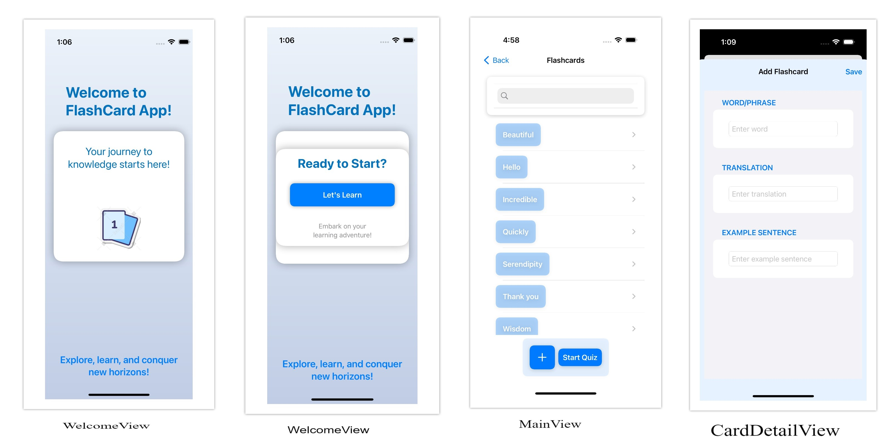
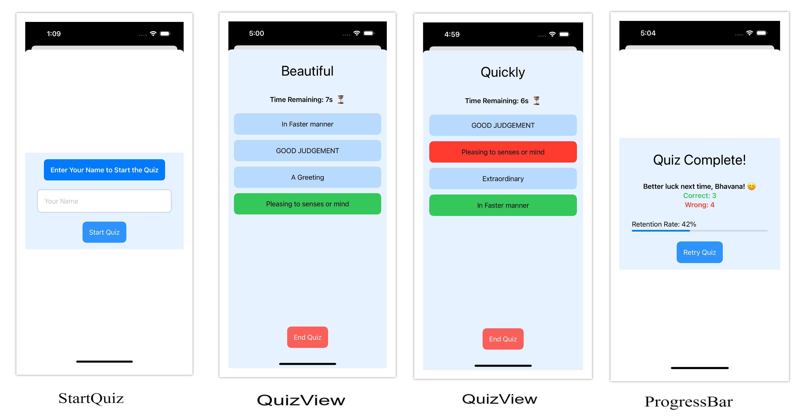

# FlashCardApp_Swift

# **Flashcards App**

A modern flashcards app designed to help users learn and retain languages or subjects more effectively through spaced repetition and adaptive learning. Users can create, manage, and review flashcards with words, translations, and example sentences, making learning engaging and personalized.

# **Features**

- Flashcard Creation and Management

- Users can create and manage flashcards for any language or subject.

- Each flashcard includes a word/phrase, translation, and an example sentence.

- Flashcards are stored locally for easy access and persistence.

# **Quiz Mode**

- Users can test their knowledge through a quiz session based on their flashcards.

- Includes multiple-choice and open-ended questions.

- Provides feedback on user performance with immediate responses and animations.

# **Spaced Repetition**

 - Flashcards are presented at increasing intervals based on user performance.

  - Frequent review for low-scored cards and less frequent for high-scored cards, ensuring efficient memory retention.

- Progress Tracking with Graphs

**Users can track learning progress over time with graphs displaying:**

- Number of flashcards mastered

- Quiz results and accuracy

- Retention rates based on spaced repetition

## Screenshots

### Flashcard Creation Screen

### Quiz Mode Screen

**Getting Started**

**Prerequisites**

- Xcode (for iOS development) or any other compatible IDE for your platform

- Basic knowledge of Swift and SwiftUI (for customization or development)

**Installation**

**Clone the repository:**

- git clone <repository-url>

- Open the project in Xcode or your preferred IDE.

- Build and run the app on a simulator or connected device.
  
**Usage**

- Create Flashcards: Enter a new word, translation, and example sentence.

- Take a Quiz: Test your memory by taking quizzes based on your saved flashcards.
  
- Track Progress: View your performance and improvement over time through visual graphs.
  
**Built With**

- Swift: Main programming language
  
- SwiftUI: For creating UI components
  
- Core Data: To store flashcards and user progress locally

**Contributing**

- Contributions are welcome! Please follow these steps:

- Fork the repository.
  
- Create a new branch for your feature: git checkout -b feature-name.

- Commit your changes: git commit -m 'Add new feature'.
  
- Push to the branch: git push origin feature-name.
  
- Submit a pull request.
  
**License**

- This project is licensed under the MIT License.
